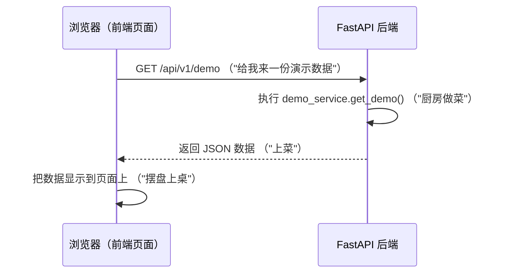
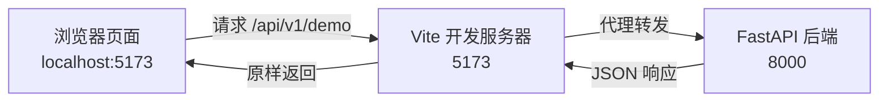
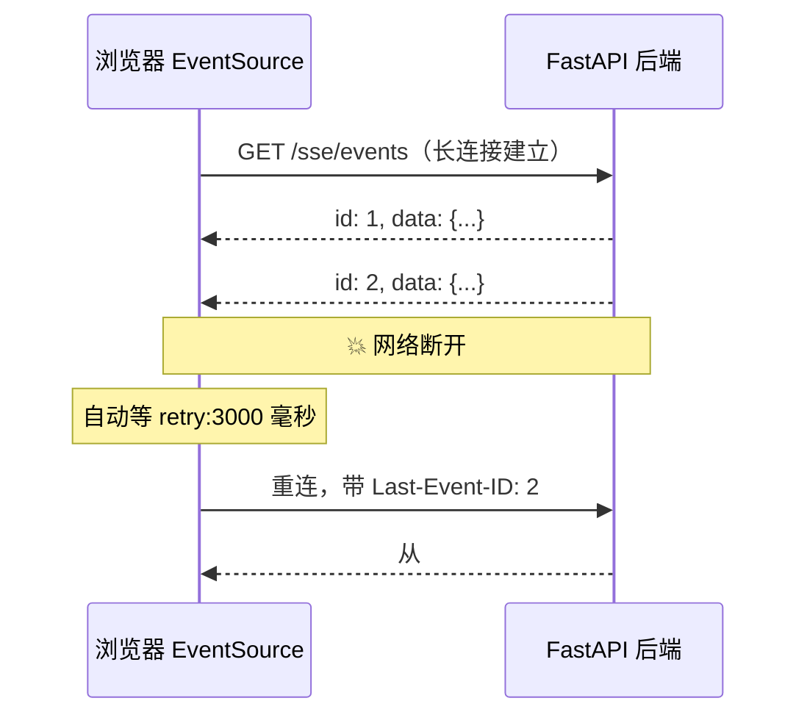
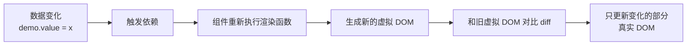
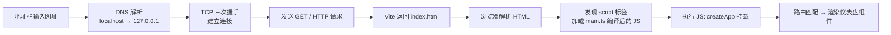
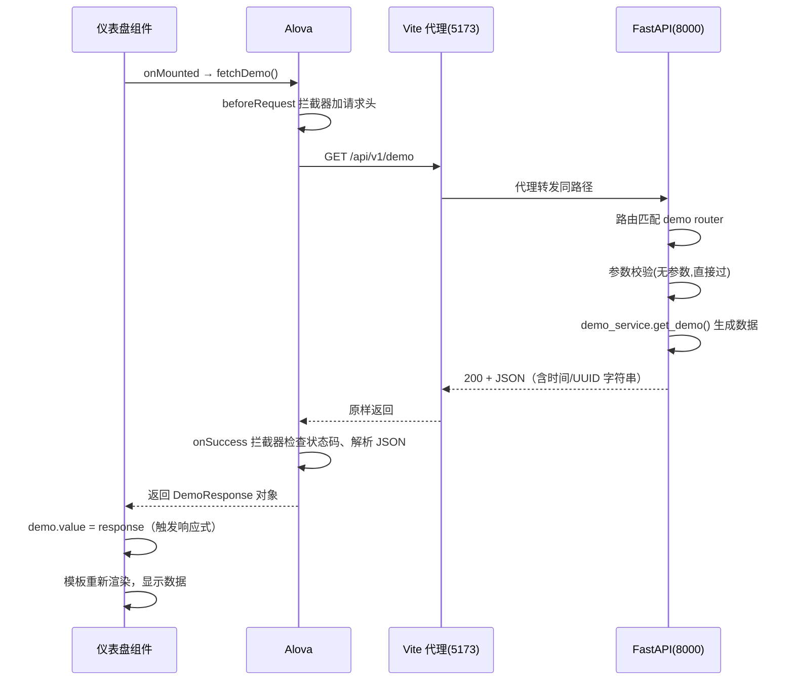

# 零基础读懂 FastAPI + Vue 3 全栈模板

> 写给只懂一点点 Python 和 JavaScript 的新手。读完这份文档，你就能：
> 1. 理解这套模板的每一个文件是干什么的
> 2. 看懂里面的核心语法（Python / TypeScript）
> 3. 自己动手改代码、加页面、加接口
>
> 建议边读边打开对应文件对照，**动手试 > 死记硬背**。

---

## 目录

- [第一部分 整体认知：这套系统是什么](#第一部分-整体认知这套系统是什么)
- [第二部分 把项目跑起来](#第二部分-把项目跑起来)
- [第三部分 Python 后端：FastAPI](#第三部分-python-后端fastapi)
- [第四部分 前端：Vue 3 + TypeScript](#第四部分-前端vue-3--typescript)
- [第五部分 前后端是怎么连起来的](#第五部分-前后端是怎么连起来的)
- [第六部分 核心原理深挖（进阶必读）](#第六部分-核心原理深挖进阶必读)
- [第七部分 跟着练：第一个小任务](#第七部分-跟着练第一个小任务)
- [第八部分 常见问题 FAQ](#第八部分-常见问题-faq)
- [第九部分 学习路线建议](#第九部分-学习路线建议)
- [附：术语速查表](#附术语速查表)

---

## 第一部分 整体认知：这套系统是什么

### 1.1 一个比喻：这套系统像一家餐厅

| 角色 | 比喻 | 本项目里 |
|------|------|---------|
| **前端** | 餐厅大堂（点菜界面、上菜摆盘） | `frontend/` 目录，Vue 3 写的网页 |
| **后端** | 厨房（接单、做菜、出餐） | `backend/` 目录，FastAPI 写的服务 |
| **HTTP 请求** | 服务员传菜单/传菜 | 浏览器发请求，后端返回数据 |
| **数据** | 菜 | 通常是 JSON 格式（一种文字化数据的标准格式） |

整个流程就像点菜：



**核心概念：前后端分离**
- 前端只管"显示"和"交互"，不碰数据
- 后端只管"处理数据"，不管页面长什么样
- 两者通过 **HTTP 接口（API）** 沟通，接口就是"菜单上写的菜名"

### 1.2 技术栈全景（先混个脸熟，后面逐个讲）

**后端（Python）：**

| 技术 | 作用 | 通俗解释 |
|------|------|---------|
| FastAPI | Web 框架 | 帮你搭建"厨房"，接收请求、返回数据 |
| Pydantic | 数据校验 | 检查"点菜单"格式对不对，缺了配料会报错 |
| Uvicorn | ASGI 服务器 | 真正监听端口、收发网络数据的"快递员" |
| pytest | 测试框架 | 自动检查"菜"做得对不对 |
| uv | 包管理器 | 管理 Python 依赖库的"库管" |

**前端（JavaScript/TypeScript）：**

| 技术 | 作用 | 通俗解释 |
|------|------|---------|
| Vue 3 | 前端框架 | 帮你把数据变成网页界面 |
| Vite | 构建工具/开发服务器 | 开发时实时刷新页面，打包时压缩文件 |
| Vue Router | 路由 | 管理"地址栏 URL"对应哪个页面 |
| Pinia | 状态管理 | 全局共享数据的"公共储物柜" |
| Alova | 请求库 | 帮你发 HTTP 请求的"服务员" |
| ECharts | 图表库 | 画折线图、柱状图 |
| Tailwind CSS | 样式工具 | 用 class 直接写样式，不用写单独的 CSS 文件 |
| shadcn/vue | 组件库 | 现成的漂亮 UI 组件（按钮、卡片等） |

### 1.3 项目目录地图

```
electric-drive-axle/
├─ backend/                          # 🐍 Python 后端
│  ├─ app/
│  │  ├─ main.py                     # 应用工厂：创建 FastAPI 实例、挂路由
│  │  ├─ core/config.py              # 配置（环境变量）
│  │  ├─ routers/                    # 接口层：定义 URL 和请求方式
│  │  │  ├─ demo.py                  #   REST 示例接口
│  │  │  └─ sse.py                   #   SSE 实时推送接口
│  │  ├─ schemas/                    # 数据模型层：定义数据的形状
│  │  │  ├─ demo.py
│  │  │  └─ sse.py
│  │  └─ services/                   # 业务逻辑层：真正"干活"的地方
│  │     ├─ demo_service.py
│  │     └─ sse_service.py
│  ├─ tests/                         # 自动化测试
│  ├─ main.py                        # 启动入口（开发用）
│  ├─ desktop.py                     # 桌面应用入口（打包成 exe 用）
│  ├─ build.py                       # 一键构建/打包脚本
│  └─ pyproject.toml                 # Python 项目配置文件
│
├─ frontend/                         # ⚡ 前端
│  └─ src/
│     ├─ main.ts                     # 前端入口：创建 Vue 应用
│     ├─ App.vue                     # 根组件：只放路由出口
│     ├─ router/index.ts             # 路由表：URL → 页面
│     ├─ stores/useDemoStore.ts      # Pinia 状态：共享数据
│     ├─ api/demo.ts                 # API 定义：前端怎么调后端
│     ├─ utils/alova.ts              # Alova 请求实例（统一配置）
│     ├─ composables/                # 可复用逻辑（实时数据缓冲）
│     ├─ components/                 # 组件（布局、图表、UI）
│     ├─ views/                      # 页面（一页一个文件）
│     ├─ types/                      # TypeScript 类型定义
│     └─ style.css                   # 全局样式（Tailwind 入口）
└─ TUTORIAL.md                       # 📖 就是这份文档
```

**分层思想（后端最重要的设计）：** routers（接口）→ services（业务）→ schemas（模型）
就像餐厅：前台（router）接单 → 厨师（service）做菜 → 菜谱（schema）规定菜长什么样。

---

## 第二部分 把项目跑起来

### 2.1 启动后端

```powershell
cd backend
uv sync          # 第一次运行：根据 pyproject.toml 安装所有依赖（只需一次）
uv run main.py   # 启动后端，监听 http://127.0.0.1:8000
```

启动后，浏览器打开这些地址试试：

- http://127.0.0.1:8000/docs —— **FastAPI 自动生成的接口文档**（超好用！每个接口都能在线测试）
- http://127.0.0.1:8000/health —— 健康检查，返回 `{"status": "ok"}`
- http://127.0.0.1:8000/api/v1/demo —— 演示数据（JSON）

> **小知识：什么是 JSON？**
> 一种给数据定规矩的文字格式，就像填表：
> ```json
> {"message": "你好", "count": 3, "ok": true}
> ```
> Python 的字典和 JavaScript 的对象都能直接转成 JSON，所以它是前后端沟通的"通用语言"。

### 2.2 启动前端

打开**另一个** PowerShell 窗口：

```powershell
cd frontend
pnpm install     # 第一次运行：安装所有前端依赖（只需一次）
pnpm dev         # 启动开发服务器，浏览器打开 http://127.0.0.1:5173
```

现在打开 http://127.0.0.1:5173，你会看到仪表盘页面，上面显示着后端返回的数据——**前后端已经连通了！**

### 2.3 前后端两个"端口"是什么？

- **端口（port）** 就像餐厅的门牌号。一台电脑上有成千上万个"门"：
  - `8000` → 后端 FastAPI 的门
  - `5173` → 前端 Vite 开发服务器的门
- 浏览器访问前端页面时，页面里的 JavaScript 会**替你去敲后端 8000 的门**（发请求）。

> **为什么开发时前端要访问 5173 而不是直接访问 8000？**
> 因为有 Vite 代理（后面第 5 部分详细讲），你在前端写的 `/api/xxx` 会自动转给后端。

---

## 第三部分 Python 后端：FastAPI

### 3.0 先学会看懂这些 Python 语法

这一节把代码里用到的 Python 语法用最直白的方式讲一遍，**不用背，遇到不认识再回来查**。

#### ① 函数与返回值

```python
def 做加法(a, b):      # def = define，定义函数；括号里是"参数"
    return a + b       # return = 把结果交出去

结果 = 做加法(1, 2)     # 调用函数，结果 = 3
```

#### ② 类型注解（Python 3.12 特性）

```python
def 做加法(a: int, b: int) -> int:   # 冒号后面写"这个参数应该是什么类型"
    return a + b                     # -> int 表示"返回整数"
```

类型注解**不影响运行**，它只是"说明书"，帮助 IDE 提示错误、让你自己看懂。这套代码类型写得很全，你跟着写就不会错。

本项目里还用了 Python 3.10+ 的 `str | None` 写法，意思是"要么是字符串，要么是 None（空）"：

```python
def f(x: str | None) -> str:
    # x 可能是个字符串，也可能是 None
    return "空" if x is None else x
```

#### ③ 类（class）—— 把数据和操作打包

```python
class 猫:
    def 叫(self, 名字: str) -> str:    # self = "我自己"，方法第一个参数永远是自己
        return f"{名字}在喵喵叫"        # f-string：在字符串里直接插变量

猫1 = 猫()          # 创建一只猫（实例）
print(猫1.叫("小黑"))  # 输出：小黑在喵喵叫
```

#### ④ async / await —— 异步（可以边等边干别的）

```python
import asyncio

async def 拿外卖():            # async 修饰 = 这是"异步函数"
    await asyncio.sleep(2)     # await = "等它完成"，等待时不阻塞别人
    return "外卖到了"

# 关键理解：普通函数是"堵住路口等"，异步函数是"让出路口等"
```

FastAPI 的所有接口都支持 `async def`，适合处理"要等很久"的操作（比如读数据库、等网络）。

#### ⑤ dataclass —— 自动生成样板代码的类

```python
from dataclasses import dataclass

@dataclass            # 这个"魔法"会自动生成 __init__ 等方法
class 点:
    x: int
    y: int

p = 点(1, 2)          # 不用写 __init__，自动支持
print(p.x)            # 1
```

`@dataclass` 前面的 `@` 是**装饰器**，可以理解为"给函数/类贴标签，加上额外功能"。

#### ⑥ 模块导入

```python
from app.routers import demo, sse   # 从 app/routers 包里导入 demo 和 sse 两个模块
from fastapi import FastAPI         # 从第三方库导入
```

`app` 是一个**包**（有 `__init__.py` 的文件夹），`app.routers` 是它的子包。

---

### 3.1 启动入口 `backend/main.py`

```python
import uvicorn

def main() -> None:
    """Start the FastAPI development server with automatic reload enabled."""
    uvicorn.run(
        "app.main:app",   # 运行 app/main.py 里的 app 这个对象
        host="127.0.0.1", # 只在本机监听（localhost）
        port=8000,        # 端口号
        reload=True,      # 自动重载：改了代码保存后自动重启服务
    )

if __name__ == "__main__":
    main()
```

**逐行讲解：**

- `uvicorn.run("app.main:app", ...)` —— Uvicorn 是 ASGI 服务器，`"app.main:app"` 意思是"去 `app/main.py` 文件里找到名叫 `app` 的 FastAPI 实例，帮我运行它"
- `if __name__ == "__main__":` —— **每个 Python 文件都会遇到**。意思是"只有直接运行这个文件时才执行下面的代码；如果这个文件是被别人 import 的，就不执行"。防止别人导入时误触发。
- `reload=True` —— 开发神器，改代码保存即生效。

> 💡 **一句话总结：这个文件就是"打开电源开关"，真正干活的是 `app/main.py`。**

### 3.2 应用工厂 `backend/app/main.py` ⭐核心文件

```python
"""FastAPI application factory and ASGI entry point."""

from pathlib import Path

from fastapi import APIRouter, FastAPI
from fastapi.middleware.cors import CORSMiddleware

from app.core.config import get_settings
from app.routers import demo, sse

DEFAULT_FRONTEND_DIR = Path(__file__).resolve().parents[1] / "static"


def create_app(
    *,
    serve_frontend: bool = False,
    frontend_dir: str | Path | None = None,
) -> FastAPI:
    """Create the API application and optionally serve a built Vue SPA."""
    settings = get_settings()
    application = FastAPI(
        title=settings.app_name,
        version=settings.app_version,
        description="RESTful API and Server-Sent Events starter backend.",
    )

    application.add_middleware(
        CORSMiddleware,
        allow_origins=list(settings.cors_origins),
        allow_credentials=False,
        allow_methods=["GET", "POST", "PUT", "PATCH", "DELETE", "OPTIONS"],
        allow_headers=["Authorization", "Content-Type", "X-Client-Name"],
    )

    api_router = APIRouter(prefix=settings.api_prefix)
    api_router.include_router(demo.router)
    api_router.include_router(sse.router)
    application.include_router(api_router)

    @application.get("/health", tags=["Health"], summary="健康检查")
    async def health_check() -> dict[str, str]:
        return {"status": "ok"}

    if serve_frontend:
        # ...（桌面版才启用，先跳过）
        pass

    return application


app = create_app()
```

**逐块讲解：**

1. **函数工厂模式**：`create_app()` 是一个"制造 FastAPI 应用"的工厂函数，可以带不同参数造出不同配置的应用（开发版不带前端页面，桌面版带）。最后一行 `app = create_app()` 直接造好一个实例，供 uvicorn 启动。

2. **CORS 中间件（跨域）**：
   ```python
   application.add_middleware(CORSMiddleware, allow_origins=[...])
   ```
   **为什么要它？** 浏览器的安全规则：A 网站（localhost:5173）的 JS 默认**不允许**访问 B 网站（localhost:8000）的数据，这叫"跨域限制"。CORS 中间件就是给后端贴了一张"允许名单"，名单上的来源可以访问。`allow_origins` 允许哪些域名，在 `config.py` 里配置。

3. **路由挂载**（就像菜单拼装）：
   ```python
   api_router = APIRouter(prefix=settings.api_prefix)  # prefix = "/api/v1"，统一前缀
   api_router.include_router(demo.router)              # 把 demo 模块的路由并入
   api_router.include_router(sse.router)               # 把 sse 模块的路由并入
   application.include_router(api_router)              # 最终挂到应用上
   ```
   因为 `demo.py` 里路由前缀是 `/demo`，加上统一前缀 `/api/v1`，最终地址就是 `/api/v1/demo`。

4. **装饰器定义接口**：
   ```python
   @application.get("/health", ...)      # 处理 GET /health 请求
   async def health_check() -> dict[str, str]:
       return {"status": "ok"}
   ```
   装饰器 `@xxx.get(路径)` 告诉 FastAPI："当浏览器 GET 这个地址时，执行下面这个函数"。函数返回值会自动变成 JSON 返回给浏览器。**这就是写接口的核心语法！**

> 💡 **你会注意到返回 `dict[str, str]`，意思是"键是字符串、值也是字符串"的字典。**

### 3.3 配置 `backend/app/core/config.py`

```python
from dataclasses import dataclass
from functools import lru_cache
from os import getenv

def _csv_env(name: str, default: str) -> tuple[str, ...]:
    """Read a comma-separated environment variable and discard empty values."""
    return tuple(item.strip() for item in getenv(name, default).split(",") if item.strip())

@dataclass(frozen=True, slots=True)
class Settings:
    app_name: str
    app_version: str
    api_prefix: str
    cors_origins: tuple[str, ...]

@lru_cache
def get_settings() -> Settings:
    """Create settings once per process."""
    return Settings(
        app_name=getenv("APP_NAME", "FastAPI + Vue 3 Template"),
        app_version=getenv("APP_VERSION", "0.1.0"),
        api_prefix=getenv("API_PREFIX", "/api/v1"),
        cors_origins=_csv_env("CORS_ORIGINS", "http://localhost:5173,http://127.0.0.1:5173"),
    )
```

**讲解：**

- `getenv("APP_NAME", "默认值")` —— 读取环境变量，没有就用默认值。环境变量是系统级配置，比如 `CORS_ORIGINS=http://localhost:5173` 可以通过命令行或 `.env` 文件注入。
- `@lru_cache` —— 缓存装饰器：同一个函数**只计算一次**，后面调用直接返回缓存结果（省内存）。这就是"单例"模式。
- `frozen=True` —— 配置创建后不可修改，防止被意外改动。
- 这种"配置集中管理"的好处：**以后想改接口前缀、端口、域名白名单，只改这一个文件/环境变量，不用翻遍整个项目。**

### 3.4 数据模型 `backend/app/schemas/demo.py`

```python
from datetime import datetime
from uuid import UUID

from pydantic import BaseModel, Field

class DemoResponse(BaseModel):
    message: str
    server_time: datetime
    request_id: UUID

class DemoEchoRequest(BaseModel):
    name: str = Field(min_length=1, max_length=50, examples=["Vue"])
    message: str = Field(min_length=1, max_length=200, examples=["Hello FastAPI"])

class DemoEchoResponse(BaseModel):
    reply: str
    received_at: datetime
```

**讲解：**

- **Pydantic 的 `BaseModel`** 是数据模型的"模板"。继承它之后：
  - 声明字段和类型（`message: str`）
  - **自动校验**：如果前端传来 `{"message": 123}`（数字不是字符串），FastAPI 自动返回 422 错误
  - **自动序列化**：`datetime`、`UUID` 等对象会自动转成 JSON 能表示的字符串
- `Field(min_length=1, max_length=50)` —— 附加约束：长度至少 1 最多 50，违规自动报错。
- 命名含义：`DemoResponse`（后端返回给前端的数据）、`DemoEchoRequest`（前端提交给后端的数据）。

> 💡 **为什么接口要"形状固定"？** 就像快递单必须填清楚收件人，后端才能准确处理。Pydantic 就是帮你检查快递单的。

### 3.5 业务逻辑 `backend/app/services/demo_service.py`

```python
from datetime import UTC, datetime
from uuid import uuid4

from app.schemas.demo import DemoEchoRequest, DemoEchoResponse, DemoResponse

class DemoService:
    """Keep business logic out of the router so it can grow independently."""

    def get_demo(self) -> DemoResponse:
        return DemoResponse(
            message="FastAPI REST 服务运行正常",
            server_time=datetime.now(UTC),
            request_id=uuid4(),
        )

    def echo(self, payload: DemoEchoRequest) -> DemoEchoResponse:
        return DemoEchoResponse(
            reply=f"{payload.name}，后端已收到：{payload.message}",
            received_at=datetime.now(UTC),
        )

demo_service = DemoService()   # 模块级单例：整个程序共用这一个实例
```

**讲解：**

- 这个文件**没有任何 FastAPI 的痕迹**，它就是纯 Python 类。好处：业务逻辑可以独立测试、独立演化。
- `datetime.now(UTC)` —— 当前 UTC 时间（全球统一标准时间，避免时区混乱）
- `uuid4()` —— 生成一个随机 UUID（全球唯一 ID），每次请求都不同，方便排查问题
- `demo_service = DemoService()` —— 模块底部创建实例，其他文件 `from app.services.demo_service import demo_service` 直接使用，这就是"单例"。

### 3.6 接口层 `backend/app/routers/demo.py`

```python
from fastapi import APIRouter, status

from app.schemas.demo import DemoEchoRequest, DemoEchoResponse, DemoResponse
from app.services.demo_service import demo_service

router = APIRouter(prefix="/demo", tags=["Demo REST"])

@router.get("", response_model=DemoResponse, summary="读取演示数据")
async def get_demo() -> DemoResponse:
    """Return a small payload used by the Vue/Pinia demo."""
    return demo_service.get_demo()

@router.post(
    "/echo",
    response_model=DemoEchoResponse,
    status_code=status.HTTP_201_CREATED,
    summary="回显提交的数据",
)
async def echo_demo(payload: DemoEchoRequest) -> DemoEchoResponse:
    """Show request-body validation and a service-layer call."""
    return demo_service.echo(payload)
```

**讲解：**

1. `router = APIRouter(prefix="/demo", ...)` —— 这个模块的所有接口都挂在 `/demo` 下。
2. `@router.get("")` —— 空路径，最终地址 = `/api/v1` + `/demo` = `/api/v1/demo`。
3. `response_model=DemoResponse` —— **声明返回的数据形状**，FastAPI 会按此校验/序列化，并在 `/docs` 里显示。
4. `@router.post("/echo", status_code=201)` —— POST 表示"提交数据"。`status_code=201` 是 HTTP 状态码"创建成功"（默认 POST 是 200）。
5. **关键理解——参数自动注入**：
   ```python
   async def echo_demo(payload: DemoEchoRequest) -> DemoEchoResponse:
   ```
   函数参数 `payload: DemoEchoRequest` —— FastAPI 看到参数类型是 Pydantic 模型，就**自动**从请求体（body）里解析 JSON、校验格式、转成对象给你。**这就是 FastAPI 最爽的地方：你只管写类型，脏活它全干了。**

6. **REST 风格**（了解即可）：GET 读数据、POST 创建、PUT/PATCH 修改、DELETE 删除——用"动词"（HTTP 方法）+ "名词"（URL）描述操作。

> 💡 **HTTP 状态码速查**：200 成功 / 201 创建成功 / 400 请求格式错 / 401 未登录 / 404 找不到 / 422 数据校验失败 / 500 服务器出错

### 3.7 SSE 接口 `backend/app/routers/sse.py` ⭐本模板精华

**先讲概念：SSE 是什么？**

- 普通 HTTP 是"一问一答"：浏览器问一次，后端答一次，连接就结束了。
- **SSE（Server-Sent Events，服务器推送事件）** 是"**打电话不挂**"：浏览器发起一次请求后，连接一直保持，后端可以**连续不断地**往这条连接上"说话"（推送消息），直到某一方挂断。
- 应用场景：股票价格、聊天消息、通知、实时日志。

```python
"""Server-Sent Events endpoint implemented with an async generator."""

import asyncio
from collections.abc import AsyncGenerator

from fastapi import APIRouter, Query, Request
from fastapi.responses import StreamingResponse

from app.services.sse_service import sse_service

router = APIRouter(prefix="/sse", tags=["SSE"])

async def generate_events(
    request: Request,
    *,
    interval_seconds: float,
    max_events: int | None = None,
) -> AsyncGenerator[str, None]:
    """Yield events until the browser disconnects or an optional limit is reached."""
    sequence = 1

    try:
        while max_events is None or sequence <= max_events:
            if await request.is_disconnected():
                break

            message = sse_service.create_message(sequence)
            yield sse_service.encode_event(
                message,
                retry_ms=3_000 if sequence == 1 else None,
            )
            sequence += 1

            if max_events is None or sequence <= max_events:
                await asyncio.sleep(interval_seconds)
    except asyncio.CancelledError:
        raise

@router.get("/events", summary="订阅实时演示消息")
async def stream_events(
    request: Request,
    interval_seconds: float = Query(default=1.0, ge=0.1, le=30.0),
    max_events: int | None = Query(default=None, ge=1, le=100),
) -> StreamingResponse:
    """Open an SSE stream. `max_events` is useful for demos and automated tests."""
    return StreamingResponse(
        generate_events(...),
        media_type="text/event-stream",
        headers={
            "Cache-Control": "no-cache",
            "X-Accel-Buffering": "no",
        },
    )
```

**逐块讲解：**

1. **异步生成器（async generator）**：
   ```python
   async def generate_events(...) -> AsyncGenerator[str, None]:
       sequence = 1
       while ...:
           yield sse_service.encode_event(...)   # yield = "吐出一条数据，但函数还没结束"
           sequence += 1
           await asyncio.sleep(interval_seconds) # 等 1 秒再吐下一条
   ```
   - 普通函数用 `return` 一次性返回；**生成器用 `yield` 一次次"吐"**，吐完还继续活着。
   - `while True` + `await asyncio.sleep(1)` = 每秒钟吐一条，永远不结束（直到浏览器断开）。
   - 注释里特别提醒：`Never use time.sleep here` —— 因为 `time.sleep` 会**堵住**整个服务器（阻塞），`asyncio.sleep` 是异步的，等待期间服务器还能服务别人。

2. **断开检测**：`if await request.is_disconnected(): break` —— 浏览器关页面了，就停止推送，释放连接。

3. **`StreamingResponse`**：FastAPI 提供的"流式响应"，把生成器吐出来的每条消息**实时**传给浏览器。

4. **查询参数**：
   ```python
   interval_seconds: float = Query(default=1.0, ge=0.1, le=30.0),
   ```
   这是"接口的可选参数"：`?interval_seconds=2` 就能控制推送频率，`ge/le`（greater/less equal）限制取值范围。浏览器访问 `/api/v1/sse/events?interval_seconds=1&max_events=5` 就只推 5 条。

### 3.8 SSE 消息服务 `backend/app/services/sse_service.py`

```python
class SseService:
    def create_message(self, sequence: int) -> SseMessage:
        return SseMessage(
            sequence=sequence,
            message=f"服务端实时消息 #{sequence}",
            timestamp=datetime.now(UTC),
        )

    def encode_event(self, message: SseMessage, *, retry_ms: int | None = None) -> str:
        """Encode one named SSE event; the final blank line is required."""
        lines = [
            f"id: {message.sequence}",
            "event: demo",
        ]
        if retry_ms is not None:
            lines.append(f"retry: {retry_ms}")
        lines.extend((f"data: {message.model_dump_json()}", "", ""))
        return "\n".join(lines)
```

**讲解：**

- `model_dump_json()` —— Pydantic 方法：把模型对象转成 JSON 字符串。即 `SseMessage` 对象 → `{"sequence":1,"message":"...","timestamp":"..."}`
- **SSE 协议格式**（硬知识，背下来）：
  ```
  id: 1                ← 消息编号（断线重连时浏览器会带上它）
  event: demo          ← 事件名（前端 addEventListener("demo") 监听）
  data: {...json...}   ← 数据本体

                       ← 空行 = 消息结束（必须有！）
  ```
- `*` 在参数里的意思：后面的参数**必须用关键字传参**（`retry_ms=3000`），不能按位置传。防止调用方搞错顺序。
- `retry: 3000` —— 告诉浏览器"如果断线，3 秒后重连"。

### 3.9 自动化测试 `backend/tests/`

**为什么写测试？** 防止"改一处坏一片"。测试就是"自动验收单"，每次改完代码跑一遍，全绿就放心。

```python
from fastapi.testclient import TestClient
from app.main import app

client = TestClient(app)   # 模拟一个"假浏览器"，不发真实网络请求

def test_health_check() -> None:
    response = client.get("/health")          # 假装浏览器请求 /health
    assert response.status_code == 200        # 断言：状态码必须是 200
    assert response.json() == {"status": "ok"} # 断言：返回内容必须是这样
```

**语法讲解：**

- `assert 条件` —— 断言：条件不满足就抛异常、测试失败。这是测试的"核心语法"。
- 测试函数名以 `test_` 开头，pytest 才能自动发现。
- `test_sse.py` 里的 `client.stream("GET", ...)` —— 模拟流式请求，`response.iter_text()` 逐段读取，验证 SSE 推送了 2 条且序号是 1、2。

**运行测试：**
```powershell
cd backend
uv run pytest
```

### 3.10 打包相关（了解即可，不用深究）

- `backend/build.py` —— 一键构建脚本：① 用 pnpm 构建前端 → ② 拷贝到 `backend/static/` → ③ 用 PyInstaller 把 Python 打包成 exe。
- `backend/desktop.py` —— 桌面版启动器：在后台线程启动 Uvicorn（随机端口），再用 PyWebView 打开原生窗口显示前端页面。里面有几个高级概念（多线程、socket 预留端口、smoke test），新手**跳过不看**，等以后有需要再看。

---

## 第四部分 前端：Vue 3 + TypeScript

### 4.0 先学会看懂这些 JS/TS 语法

#### ① const / let

```typescript
const 常量 = 1        // 不能重新赋值
let 变量 = 2          // 可以重新赋值
```

#### ② 箭头函数

```typescript
// 传统写法
function add(a: number, b: number): number { return a + b }

// 箭头函数（现代写法，到处都是）
const add = (a: number, b: number): number => a + b
```

#### ③ 类型注解（TypeScript）

```typescript
const name: string = 'vue'          // 字符串
const count: number = 1             // 数字
const list: number[] = [1, 2, 3]    // 数字数组
const maybe: string | null = null   // 字符串或空
interface 用户 {                     // 接口：定义对象的形状
  name: string
  age: number
}
const u: 用户 = { name: '小明', age: 18 }
```

TypeScript = JavaScript + 类型。浏览器不认识 TS，是 Vite 在背后把它编译成 JS。

#### ④ async / await（和 Python 几乎一样）

```typescript
async function 拿数据() {
  const data = await fetch('/api/demo')   // await = 等请求完成
  return data.json()
}
```

#### ⑤ import / export

```typescript
import { ref } from 'vue'        // 从库/文件里导入
import Demo from './Demo.vue'    // 默认导出
export const x = 1               // 导出给别人用
```

#### ⑥ 解构赋值（很常用）

```typescript
const { demo, loading } = storeToRefs(demoStore)  // 从对象里"拆"出属性
```

#### ⑦ 可选链 `?.` 和空值合并 `??`（防报错神器）

```typescript
demo?.message      // demo 存在才取 .message，不存在返回 undefined，不报错！
demo?.message ?? '暂无数据'  // 如果结果是 null/undefined，用'暂无数据'兜底
```

---

### 4.1 前端入口 `frontend/src/main.ts` ⭐

```typescript
import { createPinia } from 'pinia'
import { createApp } from 'vue'

import './style.css'          // 引入全局样式
import App from './App.vue'   // 引入根组件
import router from './router' // 引入路由

const app = createApp(App)    // 创建 Vue 应用，根组件是 App

app.use(createPinia())        // 注册 Pinia（状态管理）
app.use(router)               // 注册路由

app.mount('#app')             // 挂载到 index.html 里的 <div id="app">
```

**讲解：**

- `createApp(App)` —— Vue 应用由"组件树"组成，`App` 是树根。
- `.use(插件)` —— 给应用装上插件（Pinia、Router 都是插件）。这就像手机装 App，装完才能用。
- `.mount('#app')` —— 找到 `index.html` 中 `<div id="app">` 的位置，把整个 Vue 应用"塞"进去渲染。
- **执行顺序**：浏览器加载 index.html → 执行 main.ts → 创建应用、装插件、挂载 → 页面出现。

### 4.2 根组件 `App.vue` —— 认识 .vue 文件结构

```vue
<script setup lang="ts">
// 根组件只渲染路由出口；应用布局由路由根组件 AppLayout 提供。
</script>

<template>
  <RouterView />
</template>
```

**.vue 单文件组件（SFC）的三段式结构（这是 Vue 最重要的知识！）：**

```vue
<script setup lang="ts">
// ① 逻辑区（TypeScript）：定义变量、函数、请求数据
const message = '你好'
</script>

<template>
  <!-- ② 模板区（HTML）：写界面，{{ }} 里可以插变量 -->
  <p>{{ message }}</p>
</template>

<style scoped>
/* ③ 样式区（CSS）：scoped = 只作用于本组件，不影响别人 */
</style>
```

- `<script setup>` 里的顶层变量/函数，**自动**可以在 `<template>` 里直接用（不用 return）。
- `<RouterView />` 是"路由出口"——一个占位符，当前 URL 对应哪个页面，就渲染哪个页面组件。

> 💡 **Vue 组件的本质：一个"乐高积木"。** 每个页面、每个卡片都是一个组件，可以互相嵌套、复用。

### 4.3 路由 `frontend/src/router/index.ts`

```typescript
import { createRouter, createWebHistory } from 'vue-router'

import AppLayout from '@/components/layout/AppLayout.vue'

const router = createRouter({
  history: createWebHistory(import.meta.env.BASE_URL),  // 使用浏览器 History 模式
  routes: [
    {
      path: '/',              // URL 路径
      component: AppLayout,   // 顶级组件：带侧边栏的布局
      children: [             // 子路由：渲染在 AppLayout 的 <RouterView /> 里
        {
          path: '',                              // 空路径 = 访问 / 时
          name: 'dashboard',                     // 路由名字（编程跳转用）
          component: () => import('@/views/DashboardView.vue'),  // 懒加载
          meta: { title: '仪表盘' },             // 元信息（页面标题等）
        },
        {
          path: 'realtime',
          name: 'realtime',
          component: () => import('@/views/SseDemo.vue'),
          meta: { title: 'SSE 实时消息' },
        },
        // 以后新增页面：在这里追加一条路由
      ],
    },
  ],
})

// 路由切换后自动更新浏览器标签页标题
router.afterEach((to) => {
  const title = to.meta.title as string | undefined
  document.title = title ? `${title} · FastAPI + Vue 3 Starter` : 'FastAPI + Vue 3 Starter'
})

export default router
```

**讲解：**

- **嵌套路由**：`AppLayout` 是外层（侧边栏+顶栏），`children` 里的页面渲染在它内部的 `<RouterView />` 里。所以每个页面自动带上了统一的布局！
- **懒加载** `() => import(...)` —— 页面组件**用到时才加载**，首屏更快。
- `@/` 是 Vite 配置的别名，指向 `src/` 目录（在 `vite.config.ts` 里配置）。
- `afterEach` 是路由钩子：每次跳转完成后执行，这里用来改浏览器标题。
- `meta.title` —— 在路由里"挂"额外信息，页面组件里可以用 `route.meta.title` 读取。

### 4.4 请求层 `frontend/src/utils/alova.ts` + `api/demo.ts`

**alova.ts（请求库的"总配置"）：**

```typescript
export const API_BASE_URL = (import.meta.env.VITE_API_BASE_URL ?? '/api/v1').replace(/\/$/, '')

export const alova = createAlova({
  baseURL: API_BASE_URL,      // 所有请求的基础地址
  statesHook: VueHook,        // 和 Vue 的响应式集成
  requestAdapter: adapterFetch(),  // 底层用浏览器的 fetch 发请求

  beforeRequest(method) {
    // 每次请求发出前执行：可以统一加请求头、token 等
    method.config.headers.Accept = 'application/json'
    const token = localStorage.getItem('access_token')
    if (token) {
      method.config.headers.Authorization = `Bearer ${token}`
    }
  },

  responded: {
    async onSuccess(response) {
      // 每次响应成功后执行
      if (!response.ok) {           // 4xx/5xx 错误状态
        let message = `请求失败（HTTP ${response.status}）`
        try {
          const body = await response.json()
          message = getErrorMessage(body, response.status)  // 提取后端错误信息
        } catch { /* 忽略 */ }
        throw new Error(message)    // 抛出错误，调用方 catch 到
      }
      if (response.status === 204) return undefined  // 无内容响应
      return response.json()        // 自动解析 JSON 返回
    },
    onError(error) { throw error },
  },
})
```

**讲解：**

- `import.meta.env.VITE_API_BASE_URL` —— Vite 的环境变量。`??` 意思是"如果没有，就用 `/api/v1`"。
- `beforeRequest` —— **拦截器**：每个请求发出前自动执行。统一加 token 就是在这里，以后登录功能写好了，所有接口自动带上认证。
- `onSuccess` 里手动检查 `response.ok` —— 因为 fetch 对 4xx/5xx **不会**自动抛错，必须自己检查。

**api/demo.ts（定义具体接口）：**

```typescript
import { alova } from '@/utils/alova'

export interface DemoResponse {   // 和后端 DemoResponse 一一对应的类型
  message: string
  server_time: string
  request_id: string
}

/** 实时状态类 GET 禁用缓存，确保每次都访问后端。 */
export const getDemo = () => alova.Get<DemoResponse>('/demo', { cacheFor: 0 })

export const echoDemo = (payload: DemoEchoRequest) =>
  alova.Post<DemoEchoResponse>('/demo/echo', payload)
```

**讲解：**

- `alova.Get<DemoResponse>('/demo')` —— 发起 GET 请求到 `/api/v1/demo`，`<DemoResponse>` 是 TypeScript 泛型：告诉 TS"返回的数据是这个形状"，之后用起来就有智能提示、类型检查。
- `cacheFor: 0` —— 禁用缓存。演示数据是实时的，不希望用旧缓存。
- **以后加新接口的套路**：① 在 api 文件里写 `interface`（形状）→ ② 写一个 `alova.Get/Post` 方法 → ③ 在页面里调用。

### 4.5 状态管理 `frontend/src/stores/useDemoStore.ts` ⭐

**为什么要 Pinia？** 多个页面（仪表盘、SSE 页）都要用到"演示数据"，如果各管各的，数据不同步。Pinia 就是"公共储物柜"，谁都能存取，一改全变。

```typescript
import { computed, ref } from 'vue'
import { defineStore } from 'pinia'
import { getDemo, type DemoResponse } from '@/api/demo'

export const useDemoStore = defineStore('demo', () => {
  // ── 状态（State）：数据放这里 ──
  const demo = ref<DemoResponse | null>(null)   // 演示数据
  const loading = ref(false)                    // 是否正在请求
  const error = ref<string | null>(null)        // 错误信息

  // ── 计算属性（Getter）：由状态推导 ──
  const hasData = computed(() => demo.value !== null)

  // ── 动作（Action）：改状态的函数 ──
  async function fetchDemo(): Promise<DemoResponse | null> {
    loading.value = true        // 请求开始：显示"加载中"
    error.value = null
    try {
      const response = await getDemo().send()   // 真正发请求
      demo.value = response                     // 拿到数据存入状态
      return response
    } catch (cause) {
      error.value = cause instanceof Error ? cause.message : '无法读取 REST 演示数据'
      return null
    } finally {
      loading.value = false     // 无论成败，都结束"加载中"
    }
  }

  function clearDemo(): void {
    demo.value = null
    error.value = null
  }

  return { demo, loading, error, hasData, fetchDemo, clearDemo }
})
```

**逐块讲解：**

1. **响应式 `ref`**（Vue 最核心的概念！）：
   ```typescript
   const demo = ref<DemoResponse | null>(null)
   demo.value = response   // 注意：改 ref 里的值必须用 .value
   ```
   `ref` 把普通值包装成"**会通知的盒子**"。只要 `.value` 被改了，所有用到它的界面**自动刷新**。这就是 Vue 的"响应式"：**数据变，界面自动变**。
   > 模板里写 `{{ demo }}` 不用加 `.value`，Vue 自动解包；只有 `<script>` 里要写 `.value`。

2. **`computed`** —— 由其他状态"算出来"的值，依赖变了它自动重新算。

3. **`try / catch / finally`**：
   - `try`：尝试执行（发请求）
   - `catch`：出错了执行（记录错误信息）
   - `finally`：不管成败都执行（关掉 loading）
   
4. **`getDemo().send()`** —— Alova 的 Method 对象要 `.send()` 才真正发出请求（这是一种"惰性"设计）。

5. **组件里怎么用这个 store？**
   ```typescript
   const demoStore = useDemoStore()          // 拿到"储物柜"
   const { demo, loading, error } = storeToRefs(demoStore)  // 解构出来（要保持响应式必须用 storeToRefs！）
   demoStore.fetchDemo()                     // 调用动作
   ```

### 4.6 页面 `frontend/src/views/DashboardView.vue` ⭐完整走一遍

这是"展示 REST 数据"的页面，把整个数据流走通：

```mermaid
flowchart LR
    A[onMounted 页面加载] --> B[调用 demoStore.fetchDemo]
    B --> C[api/demo.ts: getDemo]
    C --> D[alova 实例]
    D --> E["GET /api/v1/demo (经 Vite 代理)"]
    E --> F[FastAPI demo router]
    F --> G[DemoService.get_demo]
    G --> H[JSON 响应]
    H --> I[存入 demoStore.demo]
    I --> J[模板 {{ demo.message }} 自动显示]
```

**脚本部分关键代码：**

```typescript
import { onMounted } from 'vue'
import { storeToRefs } from 'pinia'
import { useDemoStore } from '@/stores/useDemoStore'

const demoStore = useDemoStore()
const { demo, loading, error } = storeToRefs(demoStore)   // 保持响应式的解构

onMounted(() => {
  void demoStore.fetchDemo()    // 页面挂载（显示）后自动请求数据
})
```

- `onMounted` —— Vue 生命周期钩子：**组件挂载到页面后执行**。相当于"页面开门后做的第一件事"。
- `void` 前缀 —— 告诉 TS/读者"这个 Promise 我不 await，故意不管它"。

**模板部分关键语法（这些是 Vue 模板的核心）：**

```html
<!-- ① 插值：{{ }} 显示变量 -->
<p>{{ demo?.message ?? (loading ? '请求中…' : '尚无数据') }}</p>

<!-- ② v-if / v-else：条件渲染（满足才显示） -->
<p v-if="error" class="text-sm text-destructive">{{ error }}</p>

<!-- ③ 三元表达式：条件 ? 值1 : 值2 -->
{{ loading ? '刷新中' : '刷新 REST 数据' }}

<!-- ④ : 绑定属性（动态传值） -->
<Badge :variant="demo ? 'default' : 'outline'">

<!-- ⑤ @ 监听事件 -->
<Button @click="demoStore.fetchDemo">刷新</Button>
```

**v-if 用法总结（面试必问）：**
- `v-if="条件"` —— 条件为真才渲染
- `v-for="item in list"` —— 循环渲染（下面 SSE 页面有）
- `:属性="值"` —— 动态属性（简写 `v-bind:`）
- `@事件="函数"` —— 事件监听（简写 `v-on:`）

### 4.7 SSE 页面 `frontend/src/views/SseDemo.vue` ⭐

这是全项目**最复杂、最有学习价值**的页面。它用浏览器原生 `EventSource` 接收后端推送。

```typescript
const messages = ref<DisplayedSseMessage[]>([])          // 消息列表
const connectionState = ref<ConnectionState>('idle')     // 连接状态

function connect(): void {
  if (eventSource && eventSource.readyState !== EventSource.CLOSED) {
    return    // 已经连着就不重复连
  }
  connectionState.value = 'connecting'

  const source = new EventSource(`${API_BASE_URL}/sse/events`)  // 打开长连接
  eventSource = source

  source.onopen = () => {           // 连接成功
    connectionState.value = 'open'
  }

  // 后端发送的是命名事件 `event: demo`，所以用 addEventListener 监听
  source.addEventListener('demo', handleDemoEvent as EventListener)

  source.onerror = () => {          // 出错/断线
    if (source.readyState === EventSource.CONNECTING) {
      connectionState.value = 'reconnecting'   // 浏览器自动重连中
      return
    }
    connectionState.value = 'closed'
  }
}

function disconnect(): void {
  eventSource?.removeEventListener('demo', handleDemoEvent)
  eventSource?.close()     // 主动关闭连接
  eventSource = null
}

onMounted(() => { demoStore.fetchDemo(); connect() })    // 进页面自动连接
onBeforeUnmount(() => { disposeChartSeries(); disconnect() })  // 离开页面断开，防止内存泄漏
```

**讲解：**

- **`EventSource` 是浏览器的原生 API**，不需要任何库，专门用来收 SSE。用法三步：`new EventSource(url)` → 监听事件 → `.close()` 关闭。
- 断线时浏览器**自动重连**（配合后端的 `retry: 3000`，3 秒后重试）。
- **`onBeforeUnmount`** —— 离开页面时执行的钩子。**这里必须 `close()`**，否则页面关了连接还开着，会泄漏资源。
- **`?.` 可选链** —— `eventSource?.close()`：如果 `eventSource` 是 null 就不调用，防止报错。

**收到消息后做什么？**

```typescript
function handleDemoEvent(event: MessageEvent<string>): void {
  const parsed = parseSseMessage(event.data)   // ① 解析 JSON + 校验格式
  if (!parsed) { sseError.value = '收到了一条结构不正确的 SSE 消息'; return }

  const { message, timestamp } = parsed
  appendChartPoint({ timestamp, value: message.sequence })  // ② 给图表加一个点

  messages.value = [                    // ③ 把新消息插到列表最前面
    { ...message, clientKey: nextMessageKey++ },
    ...messages.value,
  ].slice(0, 50)                        // 只保留最近 50 条
}
```

**讲解：**

- `parseSseMessage` —— 收到的是字符串，`JSON.parse` 转成对象；然后逐字段检查类型对不对（防御性编程：别人发来的数据不可信）。
- `{ ...message, clientKey: nextMessageKey++ }` —— **展开运算符**：复制对象并加一个新字段 `clientKey`。为什么需要？`v-for` 循环需要唯一的 `key`，而消息的 `sequence` 每次连接都会从 1 重新开始，会重复，所以用自增的 `clientKey` 保证唯一。
- `.slice(0, 50)` —— 截断数组，只留前 50 条（防止无限增长撑爆内存）。

**模板里的 v-for 循环：**

```html
<li v-for="message in messages" :key="message.clientKey" class="...">
  <Badge variant="secondary">#{{ message.sequence }}</Badge>
  <time :datetime="message.timestamp">{{ formatTime(message.timestamp) }}</time>
  <p>{{ message.message }}</p>
</li>
```

- `v-for="item in list"` + `:key` —— Vue 循环渲染的固定搭配，`:key` 帮助 Vue 高效复用元素。

### 4.8 实时数据缓冲 `frontend/src/composables/useRealtimeSeries.ts` ⭐进阶

**composable（组合式函数）是什么？** 把"可复用的逻辑"从组件里抽出来，像乐高一样到处拼。名字约定以 `use` 开头。

这个文件做了两件事：

**① 环形缓冲区（FixedSizeBuffer）—— 数据结构经典入门：**

```typescript
class FixedSizeBuffer<T> {
  readonly #values: Array<T | undefined>   // 固定长度的数组（# 开头 = 私有，外部碰不到）
  readonly capacity: number                // 容量，比如 1000
  #head = 0                                // 头部指针（下一个要覆盖的位置）
  #size = 0                                // 当前元素个数

  push(value: T): void {
    if (this.#size < this.capacity) {      // 还没满：直接放
      const index = (this.#head + this.#size) % this.capacity
      this.#values[index] = value
      this.#size += 1
      return
    }
    this.#values[this.#head] = value       // 满了：覆盖最旧的位置
    this.#head = (this.#head + 1) % this.capacity   // 指针前移（% 取余 = 绕圈）
  }
}
```

**为什么用环形缓冲？** SSE 每秒来一个点，如果全存着，内存越来越大。环形缓冲 = **只保留最近 1000 个**：满了就覆盖最旧的。就像循环播放的录像带，永远只保留最近一段。`% capacity`（取余）让指针"绕圈"回到开头，所以叫"环形"。

**② 批量刷新（节流）：**

```typescript
const points = shallowRef<readonly RealtimeLinePoint[]>([])

function scheduleFlush(): void {
  refreshTimer = setTimeout(flush, refreshIntervalMs)   // 100ms 后才真正更新界面
}

function append(point: RealtimeLinePoint): void {
  buffer.push(point)
  dirty = true
  scheduleFlush()          // 不清空已有定时器 → 100ms 内的多次 append 只刷一次
}
```

**为什么批量刷新？** 1 秒 1 个点，如果每点都触发图表重绘，太频繁。改为：数据先攒在缓冲里，**每 100ms 才统一刷一次界面**。`setTimeout` 的妙处：100ms 内来了 10 个点，只有第一个会创建定时器，其余只是标记 `dirty`，最终只刷新一次。这叫"**节流（throttle）**"。

> 💡 **新手先看懂用法即可**：在页面里 `const { points, append, clear, dispose } = useRealtimeSeries({ maxPoints: 1000, refreshIntervalMs: 100 })`，然后 `append(点)` 加数据、`points` 读数据。

### 4.9 ECharts 图表 `frontend/src/components/charts/`

**echarts.ts（按需注册）：**

```typescript
import { LineChart } from 'echarts/charts'
import { use } from 'echarts/core'
import { CanvasRenderer } from 'echarts/renderers'

// 只注册用到的模块，减小打包体积
use([CanvasRenderer, LineChart, GridComponent, TooltipComponent, ...])
```

ECharts 很大，全部引入会让包体积爆炸。所以按需注册：只用折线图就只注册 LineChart。**以后要画柱状图，在这里加一个 BarChart 即可。**

**RealtimeLineChart.vue（封装好的图表组件）：**

```vue
<script setup lang="ts">
const props = withDefaults(defineProps<Props>(), {
  seriesName: '实时数据',   // 默认值
  yAxisName: '',
  valueDecimals: 0,
})

const chartRef = ref<InstanceType<typeof VChart> | null>(null)

onMounted(async () => {
  await nextTick()
  chartRef.value?.setOption(createChartOption(resolveThemeColors()), { notMerge: true })
  updateSeries()
})

// 监听父组件传来的 points，数据一变就更新图表
watch(() => props.points, () => { updateSeries() })
</script>

<template>
  <VChart ref="chartRef" :option="initialOption" manual-update :autoresize="{ throttle: 100 }" />
</template>
```

**讲解：**

- **`defineProps`** —— 声明这个组件**接收哪些参数**（从父组件传入）。`withDefaults` 给参数设默认值。这是组件复用的关键：父组件传 `:points="chartPoints"`，图表组件收到后渲染。
- **`watch`** —— 监听响应式值，变了就执行回调（重新更新图表数据）。
- `manual-update` —— 手动模式：初始 option 只画一次"骨架"，之后用 `setOption` 增量更新（性能好）。
- 主题颜色 `resolveThemeColors()` —— 读取 CSS 变量（`--chart-1` 等），让图表颜色跟随亮/暗主题自动变化。这是高级技巧，了解即可。

### 4.10 布局组件 `frontend/src/components/layout/`

**AppLayout.vue**（布局骨架）：`SidebarProvider` 包裹 → 左边 `AppSidebar`（侧边栏）+ 右边 `SiteHeader`（顶栏）+ `<RouterView />`（页面内容区）。**新页面不需要改这里，自动套用布局。**

**AppSidebar.vue**（侧边栏菜单）—— 以后加页面菜单就在这里：

```typescript
const data = {
  navMain: [
    { title: '仪表盘', url: '/', icon: LayoutDashboard },      // 无 items = 直接链接
    { title: '实时演示', url: '/realtime', icon: Radio,
      items: [{ title: 'SSE 实时消息', url: '/realtime' }] },  // 有 items = 可折叠子菜单
  ],
}
```

菜单高亮逻辑：`route.path === item.url` 就高亮——**路由一变，菜单自动跟随**。

**SiteHeader.vue**（顶栏）：侧边栏开关按钮 + 面包屑（根据 `route.path` 查 `pageTitles` 表显示"分组/页面"）。

### 4.11 样式体系（简单了解）

- `src/style.css` —— Tailwind CSS v4 入口：`@import "tailwindcss"` 引入框架，下面一大段 `:root { --primary: ... }` 是**CSS 变量**（设计令牌：颜色、圆角等统一管理），`.dark` 里定义暗色主题。**换主题色只改这里，全站生效。**
- 组件里写的 `class="flex flex-col gap-4"` —— Tailwind 的**原子类**：每个 class 对应一条 CSS 规则（`flex` = `display:flex`）。不用写 CSS 文件，直接在 HTML 里拼样式。
- `style.css` 里的 `@theme inline` —— 把 CSS 变量暴露给 Tailwind，这样能写 `text-muted-foreground`、`bg-muted` 这类语义类名。

---

## 第五部分 前后端是怎么连起来的

### 5.1 开发环境：Vite 代理（关键！）

看 `frontend/vite.config.ts`：

```typescript
server: {
  port: 5173,
  proxy: {
    '/api': {                          // 所有以 /api 开头的请求
      target: 'http://127.0.0.1:8000', // 转发到后端
      changeOrigin: true,
    },
  },
},
```

**原理**：浏览器页面上 JS 请求 `/api/v1/demo` → 请求发给 5173（前端服务器）→ Vite 发现以 `/api` 开头 → **偷偷转给** 8000 后端 → 拿到结果再还给你。



**好处**：① 前端代码里不用写完整地址（写 `/api/xxx` 即可）；② 请求发生在"同源"之间，没有跨域问题（所以 CORS 只是兜底配置）。

### 5.2 生产环境：打包成一个应用

1. `pnpm build` → 前端编译成静态文件（HTML/JS/CSS）到 `frontend/dist/`
2. `build.py` 把 dist 拷贝到 `backend/static/`
3. 桌面版 `create_app(serve_frontend=True)` 让 FastAPI **直接托管这些静态文件**——后端既当 API 服务器又当网页服务器，浏览器访问 8000 端口就能看到整个应用。
4. PyInstaller 把 Python + 静态文件打包成单个 exe —— **双击就能跑，不需要装 Python**。

---

## 第六部分 核心原理深挖（进阶必读）

> 前五部分教会你"怎么用"，这一部分告诉你"为什么"。
> 每一节都是前后端开发绕不开的基础，建议分多次慢慢消化，一次吃透一节。

### 6.1 HTTP 协议详解 —— 前后端共同的"普通话"

#### 什么是协议

"协议"就是双方约定好的沟通规矩。HTTP（超文本传输协议）是浏览器和服务器之间**说好的规矩**：请求长什么样、响应长什么样，都按规矩来。你已经在不知不觉中使用它无数次了——每次打开网页、每次 Alova 发请求，都是 HTTP 在底下工作。

#### 一次请求的"长相"（请求报文）

当浏览器向 `http://127.0.0.1:8000/api/v1/demo` 发请求时，实际在网络上发送的是一段纯文本（你在浏览器 F12 → Network 里能亲眼看到）：

```http
GET /api/v1/demo HTTP/1.1
Host: 127.0.0.1:8000
Accept: application/json
User-Agent: Mozilla/5.0 ...
Authorization: Bearer eyJhbGciOi...
```

它由三部分组成：

| 部分 | 内容 | 说明 |
|------|------|------|
| **请求行** | `GET /api/v1/demo HTTP/1.1` | 方法 + 路径 + 协议版本 |
| **请求头** | `Host:`、`Accept:`、`Authorization:` 等 | 每行一个"键: 值"，描述请求的附加信息 |
| **请求体**（可选） | JSON 数据 | POST/PUT 才常见；GET 一般没有 |

#### 一次响应的"长相"（响应报文）

```http
HTTP/1.1 200 OK
content-type: application/json
date: Thu, 13 Aug 2026 03:00:00 GMT

{"message":"FastAPI REST 服务运行正常","server_time":"...","request_id":"..."}
```

同样三部分：**状态行**（版本 + 状态码 + 原因短语）、**响应头**、**响应体**。

> 🔍 **动手看真实报文**：按 F12 打开开发者工具 → Network 标签 → 刷新页面 → 点一个请求 → 查看 Headers。**强烈建议现在就试**，看一次胜过读十遍。

#### 常见请求头（认个脸熟）

| Header | 作用 | 本项目出现的位置 |
|--------|------|-----------------|
| `Host` | 告诉服务器访问的是哪个域名 | 浏览器自动带 |
| `Accept` | 客户端想收什么格式 | alova.ts 里 `headers.Accept = 'application/json'` |
| `Content-Type` | 请求体是什么格式（如 `application/json`） | 发 POST 时自动带 |
| `Authorization` | 身份凭证（`Bearer 令牌`） | alova.ts 里预留的 token 逻辑 |
| `Origin` | 请求来自哪个站点（跨域判断依据） | CORS 中间件读取 |
| `User-Agent` | 浏览器/客户端身份 | 浏览器自动带 |

#### HTTP 方法（动词）：谁负责什么

| 方法 | 语义 | 比喻 | 是否修改数据 |
|------|------|------|-------------|
| GET | 读取资源 | "看看菜单" | 否（幂等）|
| POST | 创建资源 | "点一道新菜" | 是 |
| PUT | 整体替换 | "换掉这道菜" | 是（幂等）|
| PATCH | 部分修改 | "给菜加点盐" | 是 |
| DELETE | 删除 | "撤掉这道菜" | 是 |
| OPTIONS | 询问允许的操作 | "先问问规矩" | 否（CORS 预检用）|

**幂等（idempotent）**：同一个请求执行 1 次和 100 次，结果一样。GET/PUT/DELETE 幂等，POST 不幂等（每次点单都会多一道菜）。这是设计接口的重要原则。

#### 状态码：服务器用数字说话

| 分类 | 含义 | 常见例子 |
|------|------|---------|
| 1xx | 信息 | 100 Continue |
| 2xx | 成功 | **200 OK**、**201 创建成功**、204 无内容 |
| 3xx | 重定向 | 301 永久搬家、302 临时跳转、304 用缓存 |
| 4xx | 客户端错误 | **400 请求格式错**、**401 未登录**、**403 没权限**、**404 找不到**、**422 数据校验失败** |
| 5xx | 服务器错误 | **500 内部错误**、502 网关错误、503 服务不可用 |

**记忆口诀**：2 开头成了，4 开头是你的错，5 开头是服务器的错。

#### HTTP 是无状态的（重要！）

服务器**不记得**上一个请求是谁发的。每个请求都是"第一次见面"。

那怎么记住"我已经登录了"？靠**凭证**：登录成功后服务器给你发一个令牌（token），你以后的每个请求都带上它（本项目 alova.ts 里的 `Authorization: Bearer ${token}` 就是干这个的）。服务器不"记得"你，但**每次都能验证你的令牌**。就像安检不记得你，但每次都看你的身份证。

---

### 6.2 REST API 设计规范 —— 接口的"起名艺术"

**REST**（表述性状态转移）不是语言不是框架，而是一套**接口设计风格约定**。遵守它，接口就好懂、好维护。

#### 核心思想：把一切看成"资源"

接口地址 = **名词（资源）**，操作方式 = **动词（HTTP 方法）**。

```text
GET    /api/v1/users        → 获取用户列表
POST   /api/v1/users        → 创建一个用户
GET    /api/v1/users/42     → 获取 id=42 的用户
PATCH  /api/v1/users/42     → 修改 id=42 的用户
DELETE /api/v1/users/42     → 删除 id=42 的用户
```

**反面教材**（新手常犯）：`GET /api/getUserData`、`POST /api/deleteUser` —— 把动词写进 URL 了。正确做法：URL 只写名词，动词交给 HTTP 方法。

#### 本项目的 REST 范例分析

| 接口 | 分析 |
|------|------|
| `GET /api/v1/demo` | 读取演示资源（名词 demo，方法 GET）|
| `POST /api/v1/demo/echo` | 在 demo 下创建"回显"（提交数据，返回 201）|
| `GET /api/v1/sse/events` | 订阅事件流 |

#### 其他常用约定

- **复数名词**：`/users` 而不是 `/user`（有争议但社区主流）
- **层级表达从属**：`/users/42/orders` = "42 号用户的订单"
- **查询参数过滤**：`?page=2&size=20`（分页）、`?status=active`（过滤）——本项目 SSE 的 `?interval_seconds=1&max_events=5` 就是查询参数
- **用状态码表达结果**：创建成功 201、参数错 400、没权限 403
- **返回结构一致**：错误时返回 `{"detail": "错误原因"}`（FastAPI 默认就是这个格式，alova.ts 里专门解析了它）

---

### 6.3 CORS 跨域深入 —— 浏览器的"安检门"

#### 同源策略：浏览器的基础安全规则

**同源** = 协议（http/https）+ 域名（localhost）+ 端口（5173）三者完全相同。

同源策略规定：**A 网站页面里的 JS 不能随意读取 B 网站的数据**。防止恶意网站偷你的银行数据。

```
http://localhost:5173  和  http://localhost:8000   → 端口不同 → 跨域 ❌
http://localhost:5173  和  http://localhost:5173   → 同源 ✅
https://a.com  和  http://a.com                    → 协议不同 → 跨域 ❌
```

#### 跨域请求的两种类型

**① 简单请求**：GET/POST（Content-Type 是表单类）等。直接发出，浏览器看到响应头里有 `Access-Control-Allow-Origin` 才把数据交给 JS，没有就报错。

**② 预检请求（Preflight）**：带自定义头（如 `Authorization`）、或 Content-Type 是 `application/json` 的请求，浏览器会**先发一个 `OPTIONS` 请求"探路"**：

```http
OPTIONS /api/v1/demo HTTP/1.1
Origin: http://localhost:5173
Access-Control-Request-Method: POST
Access-Control-Request-Headers: content-type,authorization
```

服务器回应"允许"后，浏览器才真正发 POST。这就是为什么 CORS 配置里要放开 `OPTIONS` 方法。

#### 对照本项目的配置

```python
application.add_middleware(
    CORSMiddleware,
    allow_origins=["http://localhost:5173", "http://127.0.0.1:5173"],  # 白名单
    allow_methods=["GET", "POST", "PUT", "PATCH", "DELETE", "OPTIONS"], # 允许的方法
    allow_headers=["Authorization", "Content-Type", "X-Client-Name"],   # 允许的头
)
```

每个字段都对应浏览器"探路"时问的问题：允许谁来？允许用什么方法？允许带什么头？

**为什么开发时很少遇到 CORS 报错？** 因为走了 Vite 代理（5.1 节）：浏览器只和 5173 打交道（同源），代理偷偷转发给 8000，浏览器完全不知情。**CORS 是为"前后端部署在不同域名"的生产环境兜底的**。

---

### 6.4 JSON 深入 —— 前后端的"通用货币"

#### JSON 是什么

JSON（JavaScript Object Notation）是一种**纯文本的数据格式**，人类可读、机器好解析。它长这样：

```json
{
  "name": "Vue",
  "version": 3,
  "tags": ["前端", "框架"],
  "active": true,
  "nothing": null
}
```

支持的数据类型就 6 种：字符串、数字、布尔、null、数组、对象（嵌套任意）。

#### 三种语言视角的"对象"

| 语言 | 名称 | 例子 |
|------|------|------|
| Python | 字典 dict | `{"name": "Vue"}` |
| JavaScript | 对象 object | `{ name: 'Vue' }` |
| JSON | JSON 文本 | `{"name": "Vue"}` |

它们长得像，但不是一回事！**JSON 是一段文本**，Python/JS 里的是内存对象。转换动作：

- **序列化（serialize）**：对象 → JSON 文本。Python：`json.dumps()` / Pydantic：`model_dump_json()`；JS：`JSON.stringify()`
- **反序列化（deserialize）**：JSON 文本 → 对象。Python：`json.loads()` / Pydantic：`model_validate_json()`；JS：`JSON.parse()`

本项目里这个动作就发生在 sse_service.py 的 `model_dump_json()`（后端对象→文本）和 SseDemo.vue 的 `JSON.parse(data)`（文本→JS 对象）。

#### 时间和 UUID 怎么表示

JSON 没有"时间"类型，约定用**字符串**表示：

```json
"server_time": "2026-08-13T03:00:00.123456Z"   // ISO 8601 格式
```

- `T` 分隔日期和时间
- `Z` 表示 UTC 时间（世界标准时间）
- 前端 `new Date("2026-08-13T03:00:00Z")` 直接就能解析

UUID 也是一样存成字符串。Pydantic 负责把 `datetime`/`UUID` 对象**自动转成字符串**再发出去，前端再转回对象——这个"翻译"工作在前后端各做一次。

---

### 6.5 异步编程与事件循环 —— async/await 的本质

#### 问题：为什么"等待"是程序的大敌？

想象一个只有一个厨师的餐厅（单线程）：
- **同步（阻塞）方式**：厨师做红烧肉要 30 分钟，这 30 分钟他**干不了别的**，后面所有顾客的菜都等着 —— 这就是"阻塞"。
- **异步（非阻塞）方式**：肉下锅后设个计时器，厨师转身去切别的菜；计时器响了再回来 —— 这就是"非阻塞"。

服务器同时服务成千上万个请求，绝不能"一个请求卡住，全服务器瘫痪"。所以必须有异步。

#### 事件循环（Event Loop）：异步的发动机

Python 的 asyncio 和 JavaScript 都基于**事件循环**：一个无限循环，不停地"看看有什么活要干，干一下，再看看"。

```text
事件循环（单线程）：
┌─────────────────────────────────────┐
│  循环 {                             │
│    1. 执行当前该执行的代码           │
│    2. 检查"等待清单"（定时器/网络等）│
│    3. 有完成的？→ 继续执行它的后续   │
│  }                                  │
└─────────────────────────────────────┘
```

#### await 到底做了什么

```python
async def make_coffee():
    print("开始煮咖啡")
    await asyncio.sleep(3)      # ← 执行到这里，函数"暂停"并让出控制权
    print("咖啡好了")            #    3 秒后事件循环把它叫醒，从这里继续
```

**`await` 的语义 = "这个操作要等，我先让位，好了叫我"。** 函数本身没有阻塞任何人，等待期间事件循环继续服务别人。

#### 阻塞 vs 非阻塞：一个天上一个地下

```python
import asyncio, time

async def bad():            # 错误示范
    time.sleep(3)           # 阻塞！整个服务器卡 3 秒，所有用户都卡住
    return "ok"

async def good():           # 正确示范
    await asyncio.sleep(3)  # 非阻塞！只暂停这个函数，服务器照常服务别人
    return "ok"
```

这正是 sse.py 注释里 `Never use time.sleep here` 的原因！

#### 本项目里的异步全景

- `async def stream_events` —— SSE 接口是异步的
- `await request.is_disconnected()` —— 等待时不断开别人
- `await asyncio.sleep(interval_seconds)` —— 每秒推送一条，期间不阻塞
- 前端 `async function fetchDemo()` + `await getDemo().send()` —— 请求等待期间页面不卡死

> 💡 **一句话总结：async/await 不是"让代码更快"，而是"让等待不阻塞别人"。**

---

### 6.6 SSE 原理深入 —— 把"打电话"讲透

#### 从"一问一答"到"长连接"

普通 HTTP：请求 → 响应 → 连接关闭（快递员送完就走）。
SSE：请求 → 响应开始，但**连接一直开着**，服务器可以持续"吐"数据（快递员在你家不走，源源不断送）。

实现的关键在于 HTTP 的**分块传输（chunked）**：响应体不是一次性发完，而是一块一块地发。浏览器每收到一块，就触发一次事件。

#### SSE 协议格式（逐字段拆解）

后端 encode_event 生成的真实数据（两个事件之间用空行隔开）：

```text
id: 1
event: demo
retry: 3000
data: {"sequence":1,"message":"服务端实时消息 #1","timestamp":"..."}

id: 2
event: demo
data: {"sequence":2,"message":"服务端实时消息 #2","timestamp":"..."}

```

| 字段 | 含义 | 谁在用 |
|------|------|--------|
| `id:` | 事件编号 | **断线重连的关键**：浏览器重连时会带上 `Last-Event-ID: 最后收到的编号`，服务器可以"从断点继续发" |
| `event:` | 事件名 | 前端 `source.addEventListener('demo', handler)` 按名字监听 |
| `data:` | 数据内容 | 前端 `event.data` 读取，多条 data 行会合并（用换行）|
| `retry:` | 重连间隔（毫秒）| 断线后浏览器等多久自动重连 |
| `:` 开头 | 注释行 | 可以用来做心跳保活（服务器定期发个注释行防止连接被中间设备掐断）|

**空行 = 事件结束**，这是协议规定，必须有（所以 encode_event 里 `lines.extend((data, "", ""))` 补了两个空行）。

#### 断线自动重连机制（SSE 最大的优点）



**本项目没有实现"断点续传"**（后端没读 `Last-Event-ID`），所以重连后从 1 重新开始——这就是为什么前端要用 `clientKey` 而不是 `sequence` 当 key，以及为什么图表在重连时要插一个 `null` 断点（不让两条会话的曲线连起来）。

#### SSE vs WebSocket：怎么选？

| 对比项 | SSE | WebSocket |
|--------|-----|-----------|
| 方向 | **服务器 → 浏览器**单向 | 双向 |
| 协议 | HTTP（文本） | 独立 ws:// 协议 |
| 浏览器支持 | 原生 EventSource，自动重连 | 需要自己实现重连 |
| 复杂度 | 极简 | 较复杂 |
| 适用 | 通知、推送、实时曲线 | 聊天、游戏、双向交互 |

**口诀：只需要"服务器推给浏览器"，用 SSE 就够，别杀鸡用牛刀。**

---

### 6.7 FastAPI 依赖注入 —— 框架的"点餐式"服务

#### 什么是依赖注入（DI）

**依赖注入**：一个函数不自己造它需要的东西，而是"声明我需要什么"，由框架负责提供。

打个比方：你不自己开餐厅，而是跟服务员说"我要一份牛排"——**牛排是框架（餐厅）注入给你的**。这就是"控制反转"：谁负责创建，从"你"反转给"框架"。

#### 你其实一直在用它（不知不觉的依赖注入）

```python
@router.post("/echo", ...)
async def echo_demo(payload: DemoEchoRequest) -> DemoEchoResponse:
    return demo_service.echo(payload)
```

FastAPI 看到参数 `payload` 的类型是 Pydantic 模型，就自动：解析请求体 JSON → 校验 → 构造 `DemoEchoRequest` 对象 → 传给你。**你什么都没做，东西就送到手上了**——这就是依赖注入。

#### 依赖注入的几种"送货方式"

FastAPI 根据**参数的类型和默认值**决定怎么送：

| 写法 | 来源 | 本项目例子 |
|------|------|-----------|
| `payload: DemoEchoRequest` | 请求体（body） | `echo_demo(payload)` |
| `request: Request` | FastAPI 原始请求对象 | `stream_events(request)` |
| `interval: float = Query(1.0, ge=0.1)` | URL 查询参数 `?interval=1.0` | `stream_events(interval_seconds=...)` |
| `user_id: int` | 路径参数 `/users/{user_id}` | 以后会用到 |
| `auth: str = Header(...)` | 请求头 | 以后会用到 |

```python
# Query 内部：ge/le 表示范围约束，违反自动返回 422
interval_seconds: float = Query(default=1.0, ge=0.1, le=30.0)
```

#### 显式依赖 Depends：复用与测试的关键

当"我需要的东西"需要复杂准备（比如数据库连接、当前登录用户），用 `Depends` 显式声明：

```python
from fastapi import Depends

def get_db():
    db = create_connection()      # 假设：创建数据库连接
    try:
        yield db                  # yield = 用完自动执行下面的 finally
    finally:
        db.close()

@router.get("/users")
async def list_users(db=Depends(get_db)):   # 声明依赖
    return db.query_all()                    # 直接用，不用管创建/关闭
```

**好处**：
1. **复用**：多个接口共用 `get_db`，代码不重复
2. **自动清理**：`finally` 保证连接用完必关（yield 依赖的经典用法）
3. **可测试**：测试时换成假数据库 `app.dependency_overrides[get_db] = fake_db`，一行切换

> 💡 **本项目目前还没用 Depends**（演示逻辑太简单），但它是 FastAPI 最核心的进阶能力，做真实项目（数据库、登录）必用。

---

### 6.8 Vue 响应式原理 —— ref 背后的魔法

#### 问题：界面为什么要"自动"更新？

想象没有响应式：数据变了，你得手动找到对应 DOM 元素，把新值塞进去：

```javascript
// 手动模式（老式 jQuery 写法）
document.getElementById('message').textContent = newValue
```

数据一变，界面变，全靠**手动**，代码又乱又容易漏。Vue 的梦想：**只管改数据，界面自动同步**。

#### ref 的内部机制：getter/setter 拦截

`ref` 包装数据时，背后用了 JavaScript 的 **Proxy**（代理）：拦截对对象的一切读写操作。

```typescript
const demo = ref<DemoResponse | null>(null)

demo.value = response   // ← 这不是普通赋值！它触发了 Proxy 的 set 拦截
```

```mermaid
flowchart LR
    A[读取 demo.value<br/>触发 get 拦截] --> B[记录"谁在用我"<br/>依赖收集]
    C[修改 demo.value<br/>触发 set 拦截] --> D[通知所有使用者<br/>依赖触发]
    D --> E[界面重新渲染]
```

#### 核心概念：依赖收集 + 依赖触发

这是响应式的灵魂，用"偶像和粉丝"比喻：

- **依赖收集（get 时）**：界面渲染时读取了 `demo.value`，Vue 就记下来"这个界面组件依赖 demo"——偶像开演唱会时粉丝签到。
- **依赖触发（set 时）**：`demo.value` 被修改，Vue 翻开签到本，把依赖它的组件全部通知一遍"数据变了，重新渲染"——偶像发新歌，通知所有粉丝。

```typescript
// 伪代码：Vue 内部大致逻辑
const demo = ref(null)

// 收集：谁读取了 demo.value，就加入它的"粉丝列表"
// 触发：demo.value 被赋值，通知粉丝列表里所有组件重新渲染
```

#### computed 的原理：带缓存的"自动重算"

```typescript
const hasData = computed(() => demo.value !== null)
```

computed 内部维护了一个"依赖关系图"：
- `demo.value` 变了 → 标记 hasData "脏了" → 下次读取时重算
- `demo.value` 没变 → 直接返回缓存结果（**不重复计算**，性能好）

#### 为什么必须用 storeToRefs 解构？

```typescript
// ❌ 错误：普通解构会"切断"响应式连接
const { demo } = useDemoStore()   // demo 变成了普通变量，值变了界面不更新！

// ✅ 正确：storeToRefs 解构保留响应式
const { demo } = storeToRefs(demoStore)
```

因为 Pinia store 内部是 `reactive` 对象，直接解构等于"把值复制出来"，复制品和原数据**失去联系**。`storeToRefs` 会把每个 ref **原样**取出来（不拆开），所以连接还在。

**同理**：`ref` 对象在 `<script>` 里必须用 `.value` 读写，但模板里不用——因为 Vue 编译模板时自动"拆包"了。

#### 渲染管线（理解"自动更新"的完整链）



**虚拟 DOM**：真实 DOM 操作很慢，Vue 先在内存里用 JS 对象模拟一份"虚拟页面"（虚拟 DOM），改数据后对比新旧虚拟 DOM，**只把变化的部分**同步到真实页面。就像改装修：只改要改的墙，不把整栋楼拆了重盖。

---

### 6.9 Vue 组件通信 —— 组件之间怎么说话

组件不是孤岛，它们需要互相传数据。四大通信方式（按使用频率排序）：

#### ① 父 → 子：Props（最常见）

```vue
<!-- 父组件：SseDemo.vue -->
<RealtimeLineChart :points="chartPoints" series-name="消息序号" />

<!-- 子组件：RealtimeLineChart.vue -->
<script setup lang="ts">
const props = withDefaults(defineProps<Props>(), { seriesName: '实时数据' })
// props.points / props.seriesName 直接使用
</script>
```

- `:points="chartPoints"` 传数据，`series-name="..."` 传字符串
- **单向数据流**：子组件可以读 props，但**不能修改 props**（要改只能通知父组件改）

#### ② 子 → 父：emit 事件（第二常见）

```vue
<!-- 子组件：点击按钮时"喊一声" -->
<script setup lang="ts">
const emit = defineEmits<{ increment: [count: number] }>()
function onClick() { emit('increment', 5) }   // 喊：increment 事件，带参数 5
</script>

<!-- 父组件：监听 -->
<ChildComponent @increment="(n) => total += n" />
```

比喻：**props 是"父母递给孩子的东西"，emit 是"孩子喊父母来帮忙"**。

#### ③ 任意组件：Pinia（全局共享）

多页面共享的数据（用户信息、演示数据）放 store。谁都能 `useDemoStore()` 读写。适合"跨很多层、很多页面"的数据。

#### ④ 祖先 → 后代：provide / inject（穿透传递）

```typescript
// 祖先组件
provide('theme', 'dark')

// 任意后代组件
const theme = inject('theme')   // 'dark'
```

适合主题、语言等"所有子孙都要"的配置。本项目没用，了解即可。

**选择口诀**：父子相邻用 props/emit，跨页面共享用 Pinia，全树共享用 provide/inject。

---

### 6.10 一次请求的完整旅程 —— 把一切串起来

从你在地址栏输入 `http://localhost:5173` 到看到数据，全链路走一遍（分两个阶段）：

#### 阶段一：打开页面



#### 阶段二：页面里的 JS 请求数据（在 4.6 讲过，这里补齐细节）



**每一步你都能在代码里找到对应物**——这就是"全栈"的感觉：一条数据从后端到屏幕，全程在你的掌握之中。

---

## 第七部分 跟着练：第一个小任务

理论看完了，动手巩固。下面设计一个循序渐进的任务链，**建议每个都亲手做一遍**：

### 任务 1：改一行代码，立刻看到效果
把 `backend/app/services/demo_service.py` 里的 `message="FastAPI REST 服务运行正常"` 改成你自己的话，保存（reload 自动重启），刷新 http://127.0.0.1:5173 —— 页面上的消息变了！✅ 你刚走通了"后端 → 前端"的完整链路。

### 任务 2：加一个新接口（后端）
1. 在 `app/schemas/demo.py` 加一个模型：
   ```python
   class GreetingRequest(BaseModel):
       name: str = Field(min_length=1, max_length=20)
   ```
2. 在 `app/services/demo_service.py` 加方法：
   ```python
   def greet(self, payload: GreetingRequest) -> DemoResponse:
       return DemoResponse(
           message=f"你好，{payload.name}！",
           server_time=datetime.now(UTC),
           request_id=uuid4(),
       )
   ```
3. 在 `app/routers/demo.py` 加路由：
   ```python
   @router.post("/greet", response_model=DemoResponse)
   async def greet(payload: GreetingRequest) -> DemoResponse:
       return demo_service.greet(payload)
   ```
4. 打开 http://127.0.0.1:8000/docs，找到新接口，点 "Try it out" 测试。✅

### 任务 3：前端调用新接口
1. 在 `frontend/src/api/demo.ts` 加方法：
   ```typescript
   export const greetDemo = (payload: { name: string }) =>
     alova.Post<DemoResponse>('/demo/greet', payload)
   ```
2. 在仪表盘页面加个按钮和输入框（用 `<Input>` 组件），点击后调用并显示结果。✅

### 任务 4：加一个新页面
1. 在 `frontend/src/views/` 复制 `PageOneView.vue` 改成 `MyPageView.vue`
2. 在 `router/index.ts` 的 children 里加一条路由
3. 在 `AppSidebar.vue` 的 navMain 里加一个菜单项
4. 打开 http://127.0.0.1:5173/mypage 看效果 ✅

### 任务 5：给后端加个测试
在 `backend/tests/` 复制 `test_demo.py` 的写法，给任务 2 的新接口写个测试，然后 `uv run pytest` 跑一遍。✅

---

## 第八部分 常见问题 FAQ

**Q1：前端页面显示"请求失败"，怎么排查？**
① 后端启动了没？（`uv run main.py`，访问 http://127.0.0.1:8000/health）② 打开浏览器开发者工具（F12）→ Network 标签，看请求状态码：404 = 地址错，500 = 后端报错（看后端终端），422 = 数据格式不对。

**Q2：端口被占用怎么办？**
后端：改 `main.py` 里 `port=8000`。前端：Vite 会自动换 5174，或改 `vite.config.ts` 的 `port`。

**Q3：改了后端代码没生效？**
确认 `main.py` 里 `reload=True`（默认就有）。改了 `pyproject.toml` 里的依赖需要重新 `uv sync`。

**Q4：SSE 连不上/断线？**
① 确认后端启动（EventSource 需要真的能访问 `/api/v1/sse/events`）② 断线是正常的，浏览器会自动重连 ③ 用浏览器访问 `http://127.0.0.1:8000/api/v1/sse/events?max_events=3` 直接看原始推送。

**Q5：跨域报错（CORS）？**
开发时走 Vite 代理一般不会遇到。如果前后端分开部署，在环境变量里配置 `CORS_ORIGINS` 加上你的前端域名。

**Q6：`ref` 和 `reactive` 有什么区别？**
`ref` 包任意值（用 `.value`），`reactive` 只包对象/数组（直接用属性）。本项目主要用 `ref`，统一就好。

**Q7：TypeScript 报红怎么办？**
先读错误信息（VS Code 会提示具体位置和原因），大部分是类型不匹配。改类型就行，别用 `any` 糊弄（练习阶段可以，工作项目不行）。

**Q8：`uv` 是什么？和 pip 什么关系？**
uv 是新一代 Python 包管理器（pip + venv + 依赖锁的整合），`pyproject.toml` + `uv.lock` 保证任何人装出来的依赖版本完全一致。

---

## 第九部分 学习路线建议

**阶段 1：打基础（1-2 周）**
- Python：函数、类、字典/列表、异常处理（try/except）——本项目够用
- JS/TS：变量、函数、对象/数组、async/await、interface
- HTML/CSS 基本概念（能看懂模板就行）

**阶段 2：吃透本模板（2-4 周）**
- 反复读本文档 + 对照代码，每个文件能说出"干什么"
- 完成第七部分的任务 1-3（改代码 → 加接口 → 前端调用）
- 把 `SseDemo.vue` 的 SSE 流程画成流程图讲给别人听（讲得出来才算懂）

**阶段 3：扩展（1-2 个月）**
- 加数据库（SQLite + SQLAlchemy），让数据持久化
- 加用户登录（JWT token，alova.ts 里已经有预留位置）
- 学 Vue 官方文档（v3 中文版）+ FastAPI 官方文档（都有中文）

**推荐资源：**
- FastAPI 官方文档（中文）：https://fastapi.tiangolo.com/zh/
- Vue 3 官方文档（中文）：https://cn.vuejs.org/
- Python 官方教程（中文）：https://docs.python.org/zh-cn/3/tutorial/
- TypeScript 中文文档：https://www.tslang.cn/

---

## 附：术语速查表

遇到看不懂的词，先来这里翻一翻。

| 术语 | 一句话解释 | 详见 |
|------|-----------|------|
| HTTP | 浏览器和服务器之间通信的协议（规矩） | 6.1 |
| HTTPS | HTTP + 加密（SSL/TLS），数据在网络上不裸奔 | — |
| URL | 网址，如 `http://localhost:5173/api/v1/demo` | — |
| 请求/响应 | 客户端发出的叫请求，服务器回的叫响应 | 6.1 |
| 状态码 | 服务器用数字汇报结果（200 成功 / 404 找不到） | 6.1 |
| 请求头/响应头 | 请求或响应的"附加说明"，键值对形式 | 6.1 |
| 幂等 | 同一操作做 1 次和 100 次结果一样 | 6.1 |
| API | 应用程序接口：程序之间约定的"调用入口" | — |
| REST | 一套接口设计风格（URL 写名词，方法表动作） | 6.2 |
| JSON | 通用数据交换格式（纯文本，对象长这样） | 6.4 |
| 序列化 | 对象 → JSON 文本 | 6.4 |
| 反序列化 | JSON 文本 → 对象 | 6.4 |
| CORS | 跨域安全机制：服务器声明"允许谁访问" | 6.3 |
| 同源 | 协议+域名+端口都相同 | 6.3 |
| 代理（proxy） | 中间人：替你转发请求（Vite 代理） | 5.1 |
| 中间件 | 请求处理流水线上的"关卡"（CORS 中间件） | 3.2 |
| 异步 | 等待时不阻塞，让出控制权（async/await） | 6.5 |
| 事件循环 | 驱动异步的单线程循环"发动机" | 6.5 |
| 阻塞 | 卡住不动，别人都得等 | 6.5 |
| SSE | 服务器→浏览器单向长连接推送 | 6.6 |
| WebSocket | 双向长连接（聊天、游戏用） | 6.6 |
| EventSource | 浏览器原生接收 SSE 的 API | 4.7 |
| 依赖注入 | 函数声明需求，框架负责提供（FastAPI 核心） | 6.7 |
| 响应式 | 数据一变，用到它的界面自动更新（Vue 核心） | 6.8 |
| ref | Vue 的响应式包装盒（用 `.value` 读写） | 4.5 / 6.8 |
| computed | 由其他状态推导、带缓存的响应式值 | 4.5 / 6.8 |
| 虚拟 DOM | 内存中的"页面替身"，用于高效更新 | 6.8 |
| Props | 父组件传给子组件的数据（单向） | 6.9 |
| emit | 子组件通知父组件的事件 | 6.9 |
| 组件（Component） | 可复用的界面积木（.vue 文件） | 4.2 |
| 生命周期 | 组件从创建到销毁的过程（onMounted 等） | 4.6 |
| 路由 | URL 和页面的对应关系 | 4.3 |
| Store | Pinia 的全局状态（公共储物柜） | 4.5 |
| 拦截器 | 请求发出前/响应回来后的统一处理点 | 4.4 |
| 泛型 | 给类型"留参数"：`alova.Get<DemoResponse>` | 4.4 |
| 类型注解/类型标注 | 给变量/函数标类型（Python 和 TS 都有） | 3.0 / 4.0 |
| Pydantic | Python 的数据校验库（BaseModel） | 3.4 |
| Schema | 数据的"形状定义" | 3.4 |
| 环境变量 | 系统级配置（getenv 读取） | 3.3 |
| uv | 新一代 Python 包管理器 | FAQ Q8 |
| pnpm | 前端包管理器（npm 的升级版） | — |
| 单元测试 | 自动验证小功能正确性的代码 | 3.9 |
| 断言（assert） | 测试里"必须成立"的检查 | 3.9 |

---

> **最后一句话：别怕代码多。** 这套模板的代码量在真实项目里算很少的，而且每个文件职责单一（router 只管接口、service 只管业务、schema 只管形状）。你只需要理解"数据怎么流动"：前端发起请求 → 后端 router 接住 → service 干活 → schema 定型 → JSON 返回 → 前端状态存下来 → 界面自动刷新。这条链路走通了，全栈开发的骨架你就掌握了 💪
